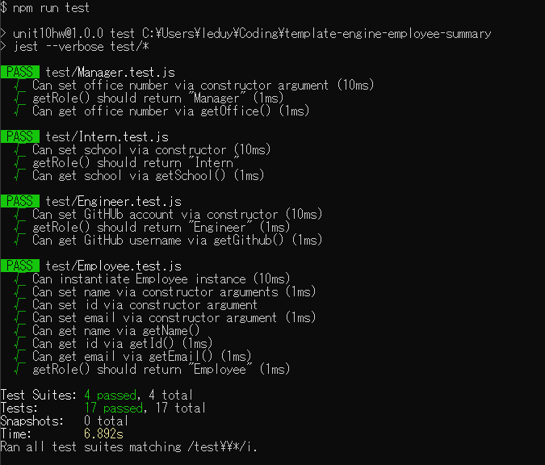
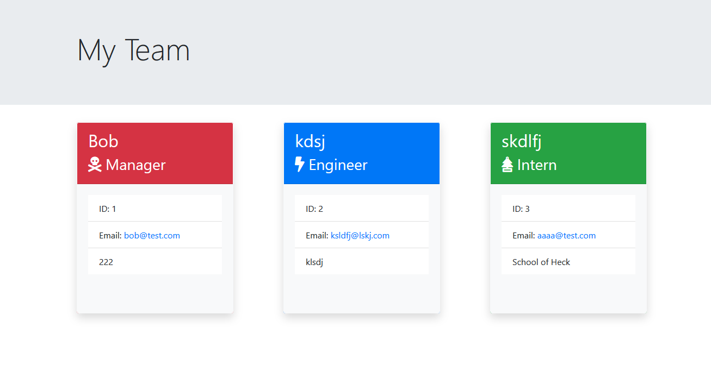

# Template Engine - Employee Summary
A Node CLI that takes employee information and generates an HTML summary page

## Approach
Breaking down the requirements, I separated out the objective into the following parts:
1. Define a constructor for the base employee, then extend it into the three employee types
2. Create html templates for each employee type
3. Using the command line, prompt the team leader to enter their information
4. Once the team leader is added, begin adding team members
5. Using the list of team members, generate the html page containing all members of the team

## Challenges
Building the class constructors provided a challenge in writing the syntax properly and forming a deeper understanding of the Node.JS coding environment. When I tried to pass the constructors into the tests, module exports did not work because I enclosed the constructor in { }, when it was unnecessary due to there being only one item. For my prompts, I wanted to separate the manager's prompts from the employee's prompts, using a separate group of questions for the two types. The challenge here was checking user input and validating the information entered. Using the documentation of Inquirer, I added a conditional to decide whether to ask for the employee's Github or school name, and also implemented validation. Checking for a valid email address was difficult, but I ended up using a regular expression to check that there was a string of characters, an @ sign, and another string followed by two or three characters after a dot.

The most significant challenge was writing the information received in the command line to the HTML templates. My plan was to read the main page template and then write it to a new file in the output, then append user cards to the html based on their roles, and finally append the closing tags necessary to render the webpage properly. I achieved part 1 and part 3 using writefilesync and appendfilesync to have these operations occur synchronously. To execute part 2 I used a for loop which identified the current employee's role, after which the appropriate template would be read and the necessary information applied before appending it to the half-generated page in the output.

The problem with this approach is that replacing content inside an HTML page via Node is more difficult than using front end JavaScript. For instance, DOM traversal is unhandled in the Node environment. It turned out that I assumed the data passed in through readFile was a string, thus the replace method did not apply correctly. Debugging revealed simple mistakes which when rectified allowed the final output page to render properly.

## Sample Usage

## Test Suite

## Sample Output
